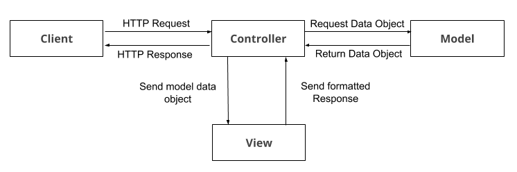

# Sencillo ejemplo del patrón MVC con PHP nativo
Ejemplo de MVC nativo (sin framework) basado en el tutorial de [Victor Robles](https://victorroblesweb.es/2013/11/18/tutorial-mvc-en-php-nativo/)

## Configuración de la base de datos
Es necesario la creación de una base de datos de donde se obtendrán los productos. 

La tabla que se consulta puede crearse con el script:

```
CREATE TABLE `products` (
  `cod` int(11) NOT NULL,
  `short_name` varchar(20) NOT NULL,
  `pvp` decimal(5,2) NOT NULL,
  `nombre` varchar(100) NOT NULL
) ENGINE=InnoDB DEFAULT CHARSET=latin1;
```

Para añadir productos a la tabla ```products``` puedes utilizar el script:

```
INSERT INTO `products` (`cod`, `short_name`, `pvp`, `nombre`) VALUES
(1, 'Monitor', '400.00', 'Dell 21 full HD'),
(2, 'Teclado', '9.99', 'Teclado inalámbrico Logitech'),
(3, 'iPad Pro', '900.00', 'Apple iPad Pro 9');
```

## Resumen patrón MVC

Existen 3 niveles de abstracción:

* **Modelo**.- Es quien define la lógica de negocio. Son las clases y los métodos que se comunican directamente con la base de datos.
* **Vista**.- Muestra la información al usuario de manera lógica y legible.
* **Controlador**.- Es el intermediario entre la vista y el modelo. Controla las interacciones del usuario en la vista. Pide los datos
al modelo y los devuelve a la vista para que los muestre. Es el encargado de realizar las llamadas a las clases y los métodos.

### Funcionamiento del MVC

1. El usuario realiza una petición.
2. El controlador captura la petición.
3. El controllador hace la llamada al modelo correspondiente.
4. El modelo interactúa con la base de datos.
5. el controlador recibe la información del modelo (base de datos) y la envía a la vista.
6. La vista muestra la información.

**Diagrama MVC**

 

